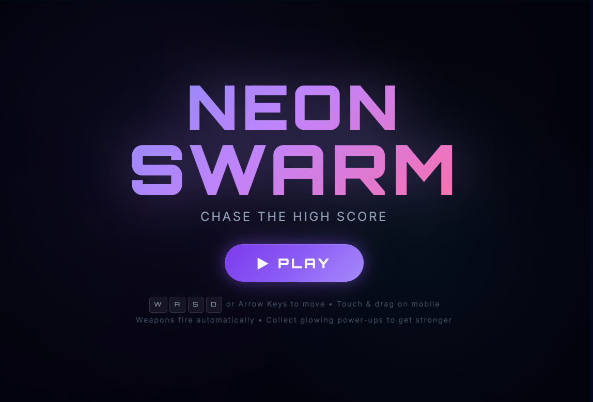
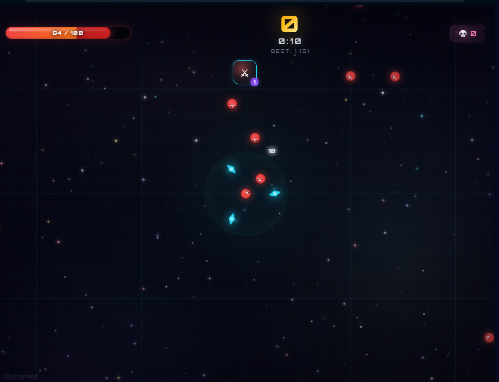
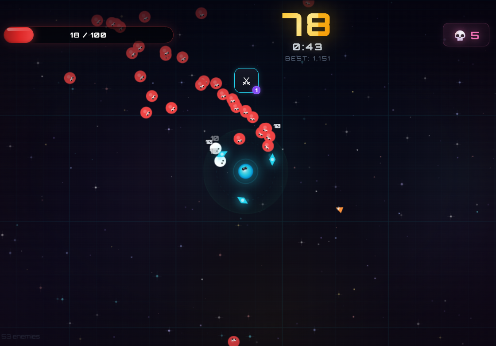
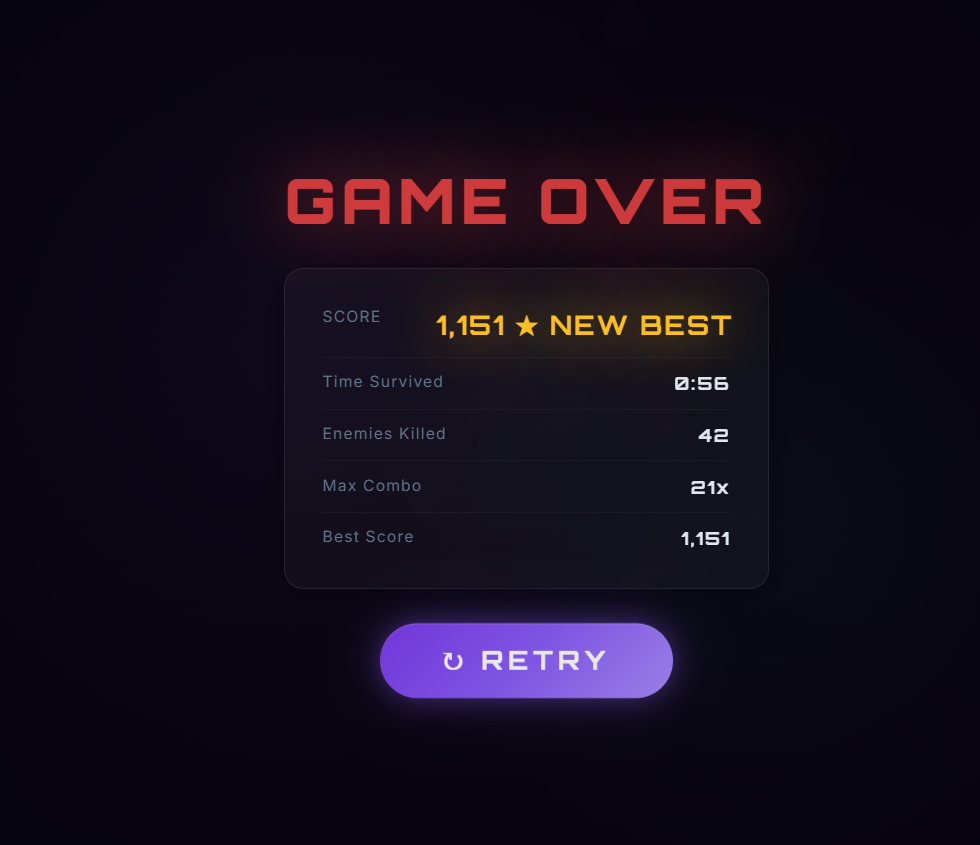

# ⚡ Neon Swarm

A Vampire Survivors-inspired auto-battler built from scratch with **vanilla HTML5 Canvas and JavaScript** — no frameworks, no libraries, no build tools. Just raw code.

**[🎮 Play it live on Game Jolt →](https://gamejolt.com/games/neon-swarm/1054561)**


---

## � Gameplay Preview

https://github.com/user-attachments/assets/NeonSwark.mp4

<video src="NeonSwark.mp4" width="100%" autoplay loop muted playsinline></video>

*22 seconds of neon chaos*

---

## �🎮 Gameplay

You're a lone survivor in a neon void, surrounded by endless waves of enemies. Your weapons fire automatically — your only job is to **move, dodge, and survive** as long as you can.

- **Auto-combat** — weapons fire on their own, you focus on positioning
- **Score chasing** — no levels, pure high-score gameplay with localStorage persistence
- **Combo system** — chain kills within 3 seconds for bonus multipliers
- **Power-up pickups** — walk over glowing orbs on the map to get new weapons, upgrades, and stat boosts
- **Boss fights** — a boss spawns every 60 seconds, dropping faster over time
- **Infinite scaling** — enemies get faster, tougher, and more numerous the longer you survive

## 🔫 Weapons

| Weapon | Description |
|--------|-------------|
| ⚔ **Orbiters** | Spinning blades orbit around you |
| ◆ **Bolt Gun** | Auto-fires projectiles at the nearest enemy |
| ✸ **Nova Burst** | Periodic AoE explosion centered on you |
| ⚡ **Lightning** | Chain lightning that arcs between enemies |
| ◈ **Missiles** | Homing missiles that seek targets |

Each weapon has **5 upgrade levels**, obtained through power-up pickups.

## 👾 Enemies

| Type | Behavior |
|------|----------|
| 🔴 **Walker** | Standard, moves toward you |
| 🟠 **Sprinter** | Fast and fragile |
| 🟥 **Brute** | Slow, tanky, hits hard |
| 🟡 **Exploder** | Detonates on death, damaging nearby enemies |
| 🟣 **Boss** | Massive HP pool, spawns periodically |

All enemies scale in health, speed, and damage over time.

## ✨ Features

- **Pure Canvas rendering** — no DOM manipulation for gameplay, everything drawn frame-by-frame
- **Procedural audio** — all sounds generated with Web Audio API (no audio files)
- **Ambient soundtrack** — continuous low drone + heartbeat at low HP
- **Particle system** — hit sparks, death explosions, gem sparkles, heal effects
- **Dynamic difficulty** — spawn rates, enemy stats, and boss frequency all scale with time
- **Combo system** — chain kills for bonus score, visual combo counter
- **Score milestones** — visual celebrations at score thresholds
- **Health orbs** — dropped by enemies or spawned on timer
- **Parallax background** — multi-layer nebulae, stars, and floating dust
- **Touch controls** — virtual joystick for mobile play
- **Responsive** — adapts to any screen size

## 🚀 How to Run

No build step needed. Just serve the files:

```bash
# Option 1: Python
python -m http.server 8080

# Option 2: Node.js
npx http-server -p 8080

# Option 3: VS Code Live Server extension
# Just right-click index.html → Open with Live Server
```

Then open `http://localhost:8080` in your browser.

## 🗂 Project Structure

```
├── index.html    # Game HTML structure + HUD elements
├── style.css     # Full visual styling, animations, responsive design
├── game.js       # Complete game engine (~2000 lines)
└── README.md
```

**Zero dependencies.** No `node_modules`, no `package.json`, no bundler. Just 3 files.

## 🎯 Controls

| Input | Action |
|-------|--------|
| `W A S D` / Arrow Keys | Move |
| Touch + Drag | Virtual joystick (mobile) |

Everything else is automatic.

## 📸 Screenshots

### Start Screen


### Gameplay




### Game Over


## 🛠 Technical Highlights

- **Custom `findNearest()` algorithm** — O(n·k) nearest-neighbor search instead of sorting the full enemy array every frame
- **Performance-optimized rendering** — simplified draw calls for 100+ entities at 60fps, aggressive off-screen culling, capped particle pools
- **Procedural sound engine** — every sound effect is synthesized in real-time using oscillators and gain envelopes
- **Entity pooling** — enemies, projectiles, gems, and particles managed with efficient splice-based arrays
- **Camera system** — smooth-follow camera with screen shake and freeze-frame hit-stop effects

## 📝 License

MIT — do whatever you want with it.

---

*Built with obsessive attention to feel, juice, and 60fps smoothness.*
